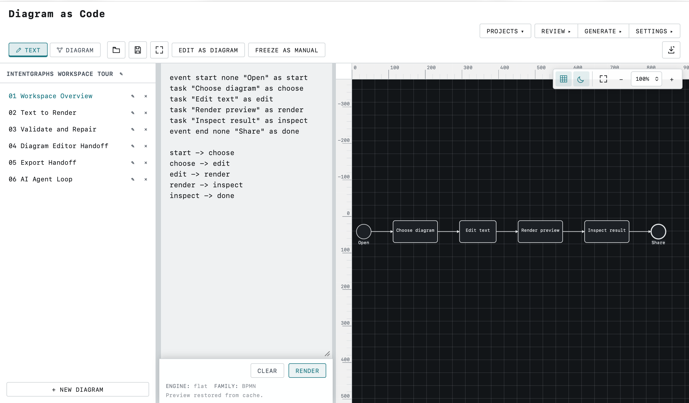

# IntentGraphs Diagram-as-Code

Validated diagram-as-code for BPMN, architecture, planning, and AI-agent workflows.

Write reviewable text. Validate syntax, BPMN structure, and geometry. Render deterministic diagrams. Export
BPMN 2.0, SVG, or editable PowerPoint. Use the browser editor or the `bpm` CLI.

## Open the playground

- [Open the public playground](https://intentgraphs.github.io/diagram-as-code/)
- [Quick start](#quick-start)
- [Examples](examples/)
- [CLI guide](docs/CLI.md)
- [Public roadmap](ROADMAP.md)



*Workspace Tour in the browser editor: named diagrams, text source, and rendered preview.*

## Workspace Tour

On a fresh browser session, the editor creates one local project named **IntentGraphs Workspace Tour** with
six compact BPMN diagrams. The first diagram renders immediately, and the sidebar lets a visitor click
through the product workflow:

1. `01 Workspace Overview` — open, choose, edit, render, inspect, export/share.
2. `02 Text to Render` — source, parse, syntax validation, layout, SVG preview.
3. `03 Validate and Repair` — syntax, BPMN structure, geometry, repair, verification.
4. `04 Diagram Editor Handoff` — visual BPMN editing, XML export, previewed Import to Text, explicit confirmation.
5. `05 Export Handoff` — SVG, BPMN 2.0 XML, editable PowerPoint, or CLI-only DOCX.
6. `06 AI Agent Loop` — optional provider draft, validation, repair/review, verification, explicit insertion.

This tour is local-first: existing IndexedDB projects are preserved, AI providers are not contacted by
default, and the Diagram Editor is available for BPMN diagrams only. Text and Diagram Editor changes are
not continuously synchronized.

## Diagrams you can test

The same validation path is available locally and in automation:

```bash
bpm validate example.bpm --json
bpm check --changed --format sarif
```

The validator reports syntax errors, the documented BPMN structural subset, geometry findings, warnings, and
machine-readable metrics. `bpm check` remains a compatibility alias for `bpm validate`.

## BPMN interoperability and exports

BPMN source exports to BPMN 2.0 XML with BPMNDI. PowerPoint is an editable visual projection of shapes,
labels, connectors, bars, and milestones; it is not a semantic round-trip. DOCX is CLI-only and uses embedded
vector SVG pages, not native editable Word shapes. SVG is available from the browser editor and CLI.

## Text-first, not text-only

The browser editor has a text mode and a separate BPMN Diagram Editor mode. Diagram-mode edits can be exported
to BPMN XML and converted through a previewed **Import to Text** action that preserves supported visual geometry
as manual DSL, but source replacement requires an explicit confirmation. There is no continuous automatic text ↔
Diagram Editor synchronization. In Text mode, rendered BPMN nodes, edges, pools, lanes, and their labels can be
clicked to highlight the matching SVG element and select its DSL declaration. The source-location mapping is shared
by the parser/runtime, so a future CLI, IDE, or workspace integration can reuse the same semantic IDs without
depending on browser DOM events.

## Scope and limitations

- Supported families are BPMN, architecture, flowcharts, mind maps, and bounded Gantt timelines.
- BPMN support covers the documented notation and structural legality subset, not full execution semantics or
  universal BPMN 2.0 compatibility.
- Projects persist in browser IndexedDB. Save Project/Open Source use portable `.bpm-project.json` bundles.
- AI is optional, provider-based, bounded, and BYOK/local-provider based. No provider is contacted by default.
- There is no hosted collaboration backend, account system, default telemetry, or published npm package yet.

See [`docs/STATUS.md`](docs/STATUS.md) for the current capability and limitation detail.

## Documentation map

| Document | Purpose |
|---|---|
| [`ROADMAP.md`](ROADMAP.md) | Public direction and explicit boundaries |
| [`CHANGELOG.md`](CHANGELOG.md) | Versioned release history |
| [`docs/README.md`](docs/README.md) | Documentation map |
| [`docs/STATUS.md`](docs/STATUS.md) | Current capabilities and limitations |
| [`docs/LANGUAGE.md`](docs/LANGUAGE.md) | Diagram grammar |
| [`docs/CLI.md`](docs/CLI.md) | Validate, render, export, review, repair, generate, and import |
| [`docs/AI_REVIEW.md`](docs/AI_REVIEW.md) | Optional AI review, repair, and generation |
| [`docs/AI-DATA-HANDLING.md`](docs/AI-DATA-HANDLING.md) | AI and local data boundaries |
| [`docs/COMING-FROM-DRAWIO-BPMNJS.md`](docs/COMING-FROM-DRAWIO-BPMNJS.md) | Migration from visual BPMN tools |
| [`CONTRIBUTING.md`](CONTRIBUTING.md) | Development and pull requests |
| [`SECURITY.md`](SECURITY.md) | Security reporting and threat model |

## Quick start

```bash
npm install
npm run build
npm test
npm run bpm -- validate examples/getting-started/hello.bpm
npm run bpm -- render examples/getting-started/hello.bpm -o /tmp/hello.svg
```

To run the editor locally:

```bash
npm run dev -w @bpm/web
```

The repository is an npm workspaces monorepo. Packages are not published to npm yet, so the `bpm` name is the
current CLI compatibility name rather than a package-download promise.
