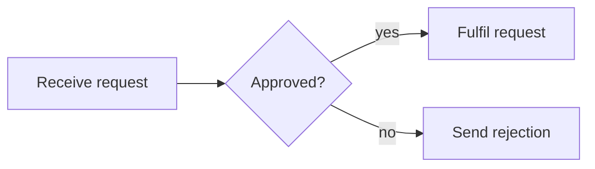
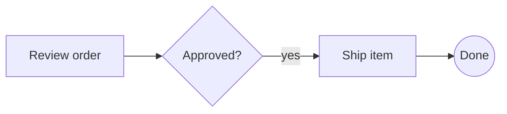
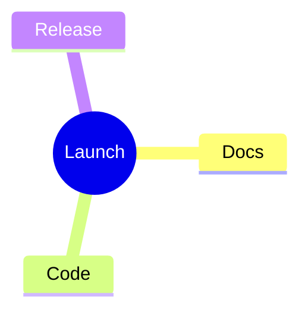

# Mermaid syntax comparison

This is an optional adoption aid for readers who already know Mermaid syntax. It is a side-by-side syntax guide only.

This repository does **not** parse Mermaid files, run the Mermaid renderer, import Mermaid diagrams, export Mermaid syntax, or promise Mermaid compatibility. Use the draw.io/bpmn-js guide for actual visual-tool migration.

## Flowchart

Mermaid:



`bpm`:

```text
diagram: flowchart
box "Receive request" as receive
decision "Approved?" as approved
box "Fulfil request" as fulfil
box "Send rejection" as reject
receive -> approved
approved => fulfil: "yes"
approved ->> reject: "no"
```

The `diagram: flowchart` directive selects the family. Node declarations use explicit stable IDs, and edge operators carry the relationship style. See [`examples/flowcharts/request-routing.bpm-equivalent`](../examples/flowcharts/request-routing.bpm-equivalent).

## BPMN process

Mermaid-style flowchart:



`bpm` BPMN:

```text
task "Review order" as t1
gateway exclusive "Approved?" as g1
task "Ship item" as t2
event end none "Done" as e1

t1 -> g1
g1 -> t2: "yes"
t2 -> e1
```

The BPMN form makes process semantics explicit: tasks, gateways, and events are typed rather than inferred from generic shapes. It can export standard BPMN 2.0 XML and can be opened in the embedded bpmn-js Diagram Editor.

## Mind map

Mermaid:



`bpm`:

```text
diagram: mindmap
mindmap "Launch" as launch
  mindmap "Docs" as docs
  mindmap "Code" as code
  mindmap "Release" as release
```

The `bpm` mind map uses exactly two spaces per nesting level and stable IDs. Child indentation defines parentage; separate edge declarations are not needed.

## What this comparison is for

- Translate familiar visual/text concepts into the `bpm` grammar.
- Show where explicit IDs, typed nodes, and family directives appear.
- Help a Mermaid user evaluate the syntax without implying a migration tool or compatibility layer.

For the supported grammar, use [`LANGUAGE.md`](LANGUAGE.md). For validation and rendering, use [`CLI.md`](CLI.md).
